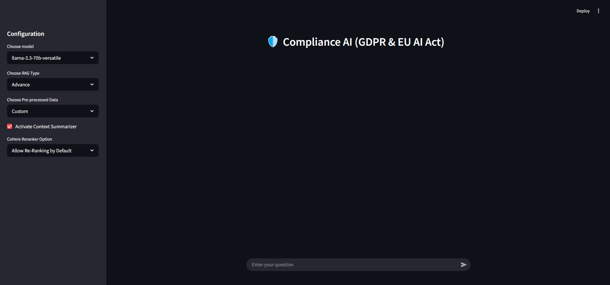
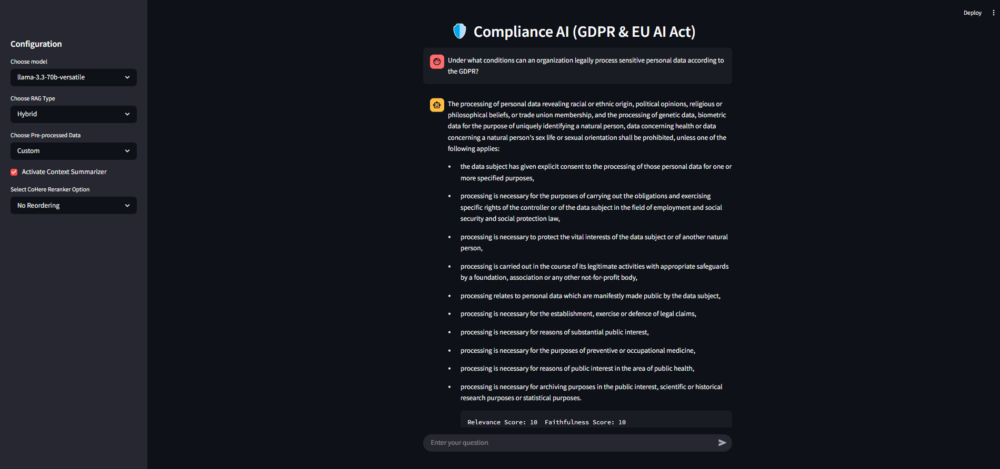

# 🛡️ Compliance AI: GDPR & EU AI Act Chatbot

A Retrieval-Augmented Generation (RAG) powered chatbot for understanding and navigating legal policies under **GDPR** and the **EU AI Act**. Ask compliance questions in natural language and get smart, contextual answers based on actual legal documents.



---

## 🚀 Features

- Natural language Q&A on GDPR & EU AI Act
- LLM-optimized sub-query generation for better document retrieval
- RAG pipeline with LangChain, ChromaDB, Groq LLMs, Huggingface Embedding Model, Cohere Re-Ranking
- Policy chunking with article/recital metadata
- Streamlit-based frontend for interactive querying

---

### 🔍 Retrieval Options

- Supports 3 RAG types: Basic, Hybrid, Advance
- Semantic retrieval and BM25 keyword-based retrieval
- Self-query retrieval (Advance RAG)
- Metadata-based filtering for GDPR / EU AI Act
- Long context reordering
- Document reranking
- Context summarization

---

### 📊 Evaluation

- LLM-based evaluation for relevance and faithfulness



---

### 🤖 Supported LLM Models

- `llama-3.3-70b-versatile`
- `llama-3.1-8b-instant`
- `gemma2-9b-it`
- `mistral-saba-24b`
- `qwen-qwq-32b`

---

## 🛠️ Tech Stack

- **Python**
- **LangChain**
- **LangSmith**
- **ChromaDB** (Vector Store)
- **FastAPI** (API backend)
- **Groq** (LLM Inference)
- **Cohere** (Re-Ranking Model)
- **Huggingface** (Embedding Model)
- **Streamlit** (Frontend)

---

## ⚙️ Project Setup

Follow the steps below to set up the project on your local machine:

---

### 1️⃣ Clone the repository

```bash
git clone https://github.com/Sameed-Khatri/Complaince-AI.git
cd Complaince-AI
```

---

### 2️⃣ Setup python virtual enviornment (for Windows)

```powershell
python -m venv .venv
.\.venv\Scripts\activate
```

---

### 3️⃣ Download C++ build tools for ChromaDB (for Windows)

[C++ Build Tools](https://visualstudio.microsoft.com/visual-cpp-build-tools/)


---

### 4️⃣ Setup api keys in .env file

### 📄 Example `.env` File

```env
GROQ_API_KEY=<your_groq_key>
LANGSMITH_API_KEY=<your_langsmith_key>
COHERE_API_KEY=<your_cohere_key>
```

LangSmith is only used for tracing, if you dont want to use it then set the following in your .env file:
```env
LANGSMITH_TRACING = false
```

| Key Name             | Platform         | Link to Create Key                                    |
|----------------------|------------------|----------------------------------------------         |
| `GROQ_API_KEY`       | Groq             | 👉 [Groq](https://groq.com/)                          |
| `LANGSMITH_API_KEY`  | LangSmith        | 👉 [LangSmith](https://www.langchain.com/langsmith)   |
| `COHERE_API_KEY`     | Cohere           | 👉 [Cohere Dashboard](https://cohere.com/)            |

---

### 5️⃣ Install dependencies in requirements.txt file (root directory)

```bash
pip install -r .\requirements.txt
```

---

### 6️⃣ Run Data Pre-Processing (root directory)

```bash
python .\run_pipeline.py
```

---

### 7️⃣ Run uvicorn server (Backend) (root directory)

```bash
python .\app.py
```

---

### 8️⃣ Run streamlit (Frontend) (root directory)

```bash
streamlit run streamlit.py
```

---

### ⚠️ Disclaimer

This project is intended for research and educational use only. It does not constitute legal advice. Always consult a legal expert for compliance decisions.
